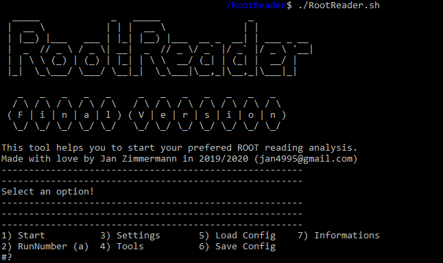

# RootReader

 Welcome to the Git repository of the **RootReader**. This piece of software helps you to create .root files out of raw data stored in .bin files.

## What are .root files?
Root files are files created by the CERN ROOT framework (https://root.cern.ch/). They store informations in a hierachical tree-like structure called ROOT tree. Each piece of information is then called leaf, while each type of information is called branch.
Example: You measured the voltage of a photodiode over a timespan of 10ns. A possible branch would then be the amplitude of the voltage, while a leaf holds for example 5mV.
Each Root File contains the information that you want it to contain. In this workgroup (SHiP HU Berlin), we are interested in the time integral of a SiPM signal. We are also interested in several timing obersables. All those branches need to be calculated and stored in the .root file.

## What are .bin files?
Binary files are just holding raw informations, e.g. the voltage values of a measurement. In case of the SHiP HU group, they are created by an analog to digital converter called WaveCatcher (https://www.caen.it/products/wavecatcher/). It digitizes the raw SiPM signals and records them using a Windows client. The way the raw data is stored in the .bin files is set in the Windows client. The used configuration puts the 1024 voltage measurements of 1000  events in a single .bin file. The files of the Windows client can be found in the WaveCatcher folder in this repository. The calibration/configuration files are also in the folders (use them to find the exact saving configuration of the bin files). The installation of the WaveCatcher client may requires to restart the PC (it needs to find drivers, which may only be available after a restart).

## Whats the reason?
The size of the .bin files is usually large, because all the raw data is included. For the analysis, however, you only need specific informations like the amplitude, integral, start point etc. So, the idea is to convert the large amounts of data into single condensed .root files. In this way, the analysis is faster and only relies on some "small" .root files. This method is also more user friendly as it allows a central debugging of the reading process.

## Lets start!
Firstly, it needs to run in a C environment (better C++) with pre-installed ROOT framework ( tested with 6.18). If it is used on Windows, the best way would be to use a WSL (Windows subsystem for linux). This can be installed directly from Microsoft Store (e.g. search for Ubuntu). **This works only on Windows 10, here is a tutorial:**

> https://medium.com/@blake.leverington/installing-cern-root-under-windows-10-with-subsystem-for-linux-beta-75295defc6d4
(I recommend using a pre-build version of ROOT)

 
If everything is installed correctly just start the software like you would start any other script:
> ./RootReader.sh
> 

It can happen that the line endings are wrong: 

     $'\r': command not found
In this case use a tool like dos2unix to convert them.

## Purpose & Customisation

I personally did efficiency measurements that mainly require time integrals to be calculated. However, when dealing with other purposes such as timing resolution studies etc. the pre-defined observables may need to be changed. Furthermore, this script is fully adjusted to my needs. Meaning that I uses parameters that are optimized for my purposes. 

 **You can read how exactly it works on the Wiki:**
 https://github.com/Uni2K/RootReader/wiki/Introduction

For instant help just open the menu item and view some helpful informations

Support: *jan4995@gmail.com*

## Important files
- Test Data (Testbeam 2019, Electrons): https://box.hu-berlin.de/d/7015628060ab4c849635/
- Test Data (Dark Count 2019): https://box.hu-berlin.de/d/fc77616a4b244451a539/
- Test Data (Calibration, 2019): https://box.hu-berlin.de/d/b23d6d3d342a4f4a8fea/

Master theses:

- J. Zimmermann: https://box.hu-berlin.de/f/6322f49e9ea64c0994ac/
- M. Ehlert: https://box.hu-berlin.de/f/13c3c7ea8b26410a8509/
- J. Schliwinski: https://box.hu-berlin.de/f/133a19bd032d4bc2825c/
- L. Shihora: https://box.hu-berlin.de/f/62bfe4bbc3234617ac59/

Root Analysis:
Multiple scripts that are needed for the RootReader:
https://github.com/Uni2K/RootAnalysis
